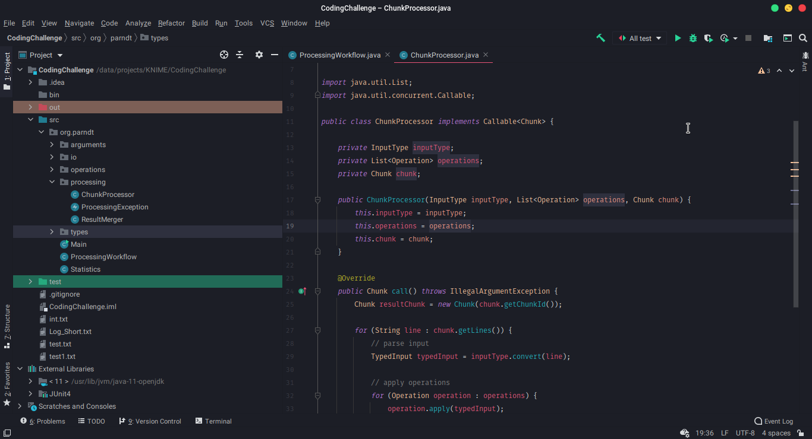

# JetBrains Horizon UI Theme

This is a port of the beautiful VSCode Horizon theme by [ jolaleye](https://github.com/jolaleye/horizon-theme-vscode) for JetBrains IDEAs. The syntax theme is a slightly adjusted version of the theme by [xShivan](https://github.com/xShivan/horizon-theme-jetbrains). The UI theme was written by myself. 

## Screenshot

## Installation

To install download the `.jar` file [here](https://github.com/arndtphillip/jetbrains-horizon-ui-theme/releases/tag/0.1). Then import it in your JetBrains IDEA (**Settings** > **Plugins** > **Install Plugin from Disk...**). Now you should be able to select **Horizon** from the Theme dropdown list. 
 